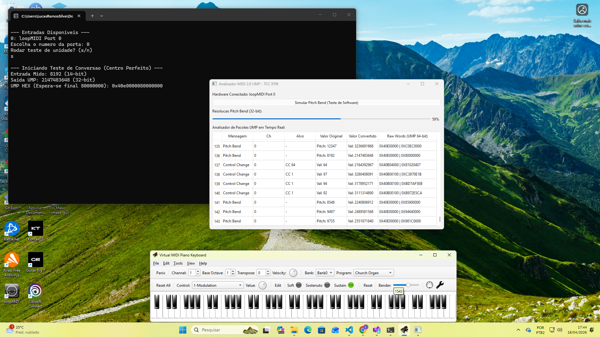
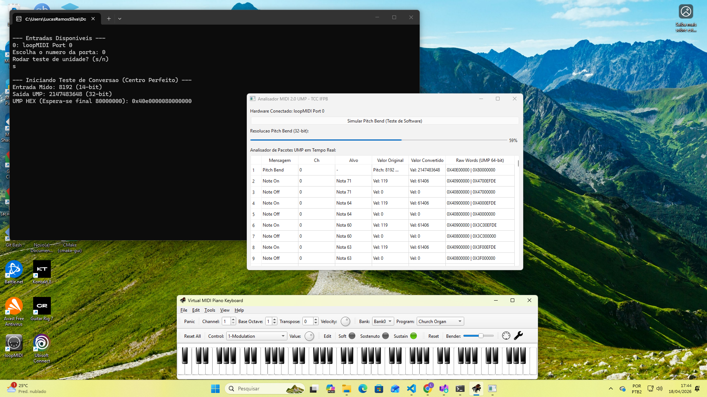

## 🎹 Conversor e Analisador MIDI 1.0 para MIDI 2.0 (UMP) - Versão C++
Bem-vindo à versão de alta performance do meu Trabalho de Conclusão de Curso (TCC) desenvolvido no Instituto Federal da Paraíba (IFPB).

Originalmente concebido em Python, este projeto foi portado para C++17 utilizando o framework Qt6 para garantir menor latência no processamento de pacotes UMP (Universal MIDI Packet) e uma interface gráfica mais robusta.

Projeto em python: https://github.com/LucasRamosSilva-15/midi-ump-bridge
---

## Assista à demonstração do sistema em tempo real: [Link para o Vídeo no Drive]

https://drive.google.com/file/d/1uy8M-NuNLCTuwC7DK9pBds0iCnk3s3lD/view?usp=sharing

---

## Sumário

- [O que é MIDI?](#-o-que-é-midi)
- [Sobre o Projeto](#-sobre-o-projeto)
- [Tecnologias Utilizadas](#-tecnologias-utilizadas)
- [Demonstração Visual](#-demonstracao-visual)
- [Estrutura do Código (C++)](#-estrutura-do-codigo-c)
- [Guia de Compilação e Execução (Windows)](#-guia-de-compilacao-e-execucao-windows)
- [Guia de Compilação e Execução (Linux)](#-guia-de-compilacao-e-execucao-linux)
- [Validação de Dados](#-validacao-de-dados)
- [Hardware de Teste](#-hardware-de-teste)
- [Autor](#-autor)

---

## O que é MIDI?

Se você não é da área de tecnologia musical, pode estar se perguntando o que exatamente esse sistema faz e por que ele precisa ser convertido. Uma boa regra para entender o MIDI (*Musical Instrument Digital Interface*) é: **MIDI não é áudio, é partitura digital.**

Diferente de um arquivo MP3 ou WAV, que gravam a "onda sonora" real de uma música, o protocolo MIDI transmite apenas **instruções matemáticas**. Quando um músico aperta uma tecla em um teclado físico, em vez de enviar o som pronto para o computador, o teclado envia dados como:

* **Qual nota foi tocada?** (que é indicado pela numeração da nota do teclado, como por exemplo, 51)
* **Com que força a tecla foi pressionada?** (Velocity, que é a intensidade que aquela nota foi tocada)
* **Quando ela foi solta?** * **O músico usou alguma alavanca de efeito?** (Pitch Bend, que é usado para alterar a afinação (pitch) de uma nota de forma contínua e temporária)

O computador (ou sintetizador) lê essas instruções e "toca" os instrumentos virtuais na hora.


---

## Sobre o Projeto
Esta PoC (Prova de Conceito) foca na ponte tecnológica entre o protocolo MIDI 1.0 (8-bit/14-bit) e o novo MIDI 2.0 (32-bit/64-bit). O software captura bytes brutos de dispositivos MIDI reais, realiza o upscale da resolução matemática e encapsula o resultado no formato de pacotes de 64 bits (UMP Message Type 4).

---

## Tecnologias Utilizadas
Linguagem: C++17

Framework GUI: Qt 6.11.0 (MSVC 2022)

Drivers MIDI: RtMidi (Realtime MIDI I/O)

Build System: CMake 3.16+

Padrão: MIDI 2.0 / Universal MIDI Packet (UMP)

---

## Demonstração Visual
Abaixo, a interface desenvolvida em Qt6 que monitora a entrada de notas e o gráfico de Pitch Bend em alta resolução.





---

## Estrutura do Código (C++)
Diferente da versão Python, a arquitetura C++ separa as responsabilidades em classes e headers:

src/ump.h: Estrutura de dados para mensagens de 64 bits e lógica de análise de bits.

src/converter.cpp: Implementação da matemática de conversão (ex: upscale de Velocity para 16-bit).

src/gui.cpp: Gerenciamento da janela principal e dos sinais de atualização da interface.

src/main.cpp: Ponto de entrada que gerencia o console de seleção de portas e a inicialização do Qt.

---

## Guia de Compilação e Execução (Windows)
Para rodar este projeto, você precisará do Visual Studio 2022 (com C++), CMake e o Qt6 instalados.

1. Pré-requisitos
- **Qt6:** Baixe via Qt Online Installer (Marque a opção MSVC 2022 64-bit).
- **RtMidi:** A biblioteca é baixada e compilada automaticamente pelo CMake (FetchContent).

2. Compilando via Terminal
Abra o terminal na pasta raiz do projeto e execute:

### Criar pasta de build
```bash
mkdir build
cd build
```
### Gerar arquivos do projeto
```bash
cmake ..
```

### Compilar o executável
```bash
cmake --build . --config Release
```
4. Rodando
O executável será gerado em build/Release/MIDI2Bridge.exe.

Ao abrir, o terminal solicitará a escolha da porta MIDI. Após a seleção, a interface gráfica será carregada automaticamente.

---
## Guia de Compilação e Execução (Linux)
O processo no Linux (distribuições baseadas em Debian/Ubuntu) é nativo e simplificado, pois as bibliotecas são instaladas e resolvidas diretamente pelo sistema.

1. Instalando Dependências
Abra o terminal e instale os pacotes de compilação, o framework Qt6 e a biblioteca ALSA (necessária para o RtMidi gerenciar dispositivos de áudio):
```bash
sudo apt update
sudo apt install build-essential cmake qt6-base-dev libasound2-dev
```

2. Compilando o Projeto
Na pasta raiz do projeto, execute:
```bash
mkdir build
cd build
cmake ..
cmake --build .
```

3. Executando
```bash
./MIDI2Bridge
```

---
## Validação de Dados
O software inclui uma rotina de teste de unidade integrada. Ao iniciar, você pode optar por rodar o Teste de Pitch Bend.

O que o teste valida?
O padrão UMP exige que o centro do Pitch Bend (repouso) seja representado pelo valor hexadecimal 0x80000000 no Word 2 da mensagem. O teste injeta o valor MIDI 1.0 8192 (centro) e valida se a saída C++ atinge exatamente o bitmask esperado.

---

## Hardware de Teste
Para garantir a precisão, o sistema foi homologado com:

Teclado Físico: Yamaha PSR E383 (USB-MIDI).

Virtualização: loopMIDI + VMPK (Virtual MIDI Piano Keyboard).

---

## Autor
Desenvolvido por Lucas Ramos Silva como parte do TCC do curso tecnico em informatica no IFPB CG.
Professor_Orientador: Carlos Henrique Alencar
